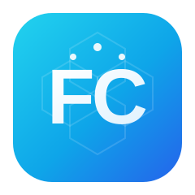

<p align="center">
  
</p>

<h1 align="center">FyqyClaw · Feiyang Qiyuan AI</h1>

<p align="center">
  <b>Full-lifecycle AI-driven development tool — dual IDE + AI Agent modes, from requirements to code in one place</b>
</p>

<p align="center">
  <a href="https://github.com/wch887292/FyqyClaw/stargazers"></a>
  <a href="https://github.com/wch887292/FyqyClaw/releases"></a>
  <a href="https://github.com/wch887292/FyqyClaw/blob/main/LICENSE"></a>
  
  
  
  
  
  
  
</p>

<p align="center">
  <a href="#-core-features">Core Features</a> ·
  <a href="#-quick-start">Quick Start</a> ·
  <a href="#-architecture">Architecture</a> ·
  <a href="#-tech-stack">Tech Stack</a> ·
  <a href="#-faq">FAQ</a> ·
  <a href="#-roadmap">Roadmap</a> ·
  <a href="#-license">License</a>
</p>

---

## 📖 Introduction

**FyqyClaw (Feiyang Qiyuan AI)** is a full-lifecycle development tool that deeply integrates large-model AI capabilities, covering the complete engineering chain: requirement breakdown, coding, project comprehension, debugging, code review, and change management.

It supports **traditional IDE precision control** and **fully-autonomous AI Agent development** in two switchable modes, fitting both individual developers and enterprise-grade iterative workflows.

> **Name meaning**: "Fyqy" is the pinyin abbreviation of "Feiyang Qiyuan" (飞扬企源). "Claw" implies precisely grabbing code and catching problems like a claw. Together it means "Feiyang Qiyuan's AI development weapon."

### Comparison with Cursor / Windsurf / Trae

| Aspect | FyqyClaw | Cursor / Windsurf / Trae |
|--------|---------|--------------------------|
| **Dev mode** | IDE + SOLO dual mode, switchable anytime | AI-assist centric, no standalone Agent mode |
| **AI autonomy** | SOLO mode: AI plans, codes, tests, reviews autonomously | Step-by-step instruction interaction |
| **MCP protocol** | Native support, extensible toolchain | Partial / plugin required |
| **Security** | Privacy mode + sandbox execution + triple-encrypted API Key | Basic encryption |
| **Open source** | ✅ Apache-2.0 open source | ❌ Closed commercial product |
| **Local deployment** | ✅ Fully local | Partially cloud-dependent |
| **Cost** | Free & open source (bring your own API Key) | Paid subscription or limited free quota |

---

## ✨ Core Features

### 🎯 Dual Development Modes — choose by scenario

| Mode | Lead | Best for | Highlights |
|------|------|---------|------------|
| **🖥️ IDE Mode** | Developer | Precise coding, debugging, small changes | Full editor toolchain, CUE smart coding engine, Git management, line-level control |
| **🤖 SOLO Mode** | AI Agent | New project scaffolding, large refactors, batch features | AI autonomously plans & executes, auto-generates + tests + reviews, task-level control |

Both modes support **one-click switching anytime** (shortcut `Ctrl+Shift+M`), independent of each other.

### 🤖 Full-lifecycle AI Coding

**Multi-model compatible base** — 8 built-in providers, one-click switch:

| Provider | Supported models |
|--------|---------|
| **OpenAI** | GPT-4o, GPT-4o-mini, GPT-4-turbo, O1 series |
| **Anthropic** | Claude Sonnet 4, Claude 3.5 Sonnet, Claude Opus 4 |
| **DeepSeek** | DeepSeek V3, DeepSeek R1, DeepSeek Coder |
| **Zhipu AI** | GLM-4-Plus, GLM-4-Air, GLM-4-Flash |
| **Qwen (Tongyi)** | Qwen Plus, Qwen Turbo, Qwen Max, Qwen 2.5 Coder |
| **Google Gemini** | Gemini 2.5 Pro, Gemini 2.0 Flash |
| **SiliconFlow** | Various hosted open-source models |
| **Custom model** | Any OpenAI-compatible endpoint |

**CUE Smart Coding Engine** — chained completion, multi-line edits, auto dependency import, batch reference refactor; supports Python / TypeScript / Golang and other mainstream languages.

**Autonomous AI Agent development** — in SOLO mode the AI can autonomously:
1. 📋 **Requirement breakdown** — analyze needs, split into executable task lists
2. 🔧 **Tech selection** — recommend tech & frameworks per project traits
3. 📝 **Code generation** — auto-generate complete project or module code
4. ✅ **Automated testing** — generate and run test cases
5. 🔄 **Error fixing** — auto-attempt fixes upon discovering errors
6. 👁️ **Code review** — security & quality review of generated code
7. 📊 **Change summary** — generate change digest and commit messages

**Full-context awareness** — files, folders, Git repos, terminal logs, business docs, and web resources can all serve as AI context, giving the AI complete project understanding.

### 🔒 Enterprise-grade Security

| Security feature | Description |
|---------|------|
| **Privacy mode** | On by default; all code, conversations, generated content not uploaded for training, kept fully local |
| **Sandbox execution** | Isolated execution of AI-generated commands, blocks high-risk ops, restricts file access, auto-terminates anomalies |
| **Triple-encrypted API Key** | Browser fingerprint + session salt + time obfuscation; no plaintext storage; even admins cannot view |
| **Log masking** | Logs auto-mask API Keys, only show `sk-****...****ab12` format |
| **Zero data collection** | Open-source edition collects no user data; no network registration or login required |

### 🔌 Open Ecosystem Extensibility

- **MCP protocol support** — connect Git, filesystem, GitHub, databases, etc.; AI can directly call external tools
- **Skill system** — pluggable AI assist skills (code review, doc generation, test generation, commit-message generation, etc.)
- **Plugin system** — supports themes, language packs, feature extensions

---

## 🚀 Quick Start

### System Requirements

| Platform | Support |
|------|---------|
| Windows 10+ | ✅ Full support |
| macOS 12+ | ✅ Full support |
| Linux (Ubuntu 20.04+) | ✅ Full support |
| WSL 2 | ✅ Supported |

### Installation

#### Option 1: Download installer

Download the installer for your platform from [Releases](https://github.com/wch887292/FyqyClaw/releases):

```bash
# Windows
FyqyClaw-Setup-x.x.x.exe

# macOS
FyqyClaw-x.x.x.dmg

# Linux
FyqyClaw-x.x.x.AppImage
```

#### Option 2: Build from source

```bash
# Clone the repo
git clone https://github.com/wch887292/FyqyClaw.git
cd FyqyClaw/fyqyclaw-app

# Install dependencies
npm install

# Start dev server (Web mode)
npm run dev

# Or launch the Electron desktop app
npm run electron:dev
```

#### Option 3: Build installers from source

```bash
# Build for all platforms (current platform produces an installer)
npm run electron:build

# Or target a specific platform
npm run build:win      # Windows NSIS installer (.exe)
npm run build:mac      # macOS DMG + ZIP (requires macOS)
npm run build:linux    # Linux AppImage + deb (requires Linux)
```

Build artifacts are output to the `release/` directory:

| Artifact | Platform | Format |
|------|------|------|
| `FyqyClaw-Setup-${version}-win-x64.exe` | Windows | NSIS installer |
| `FyqyClaw-${version}-mac-x64.dmg` | macOS Intel | DMG disk image |
| `FyqyClaw-${version}-mac-arm64.dmg` | macOS Apple Silicon | DMG disk image |
| `FyqyClaw-${version}-linux-x86_64.AppImage` | Linux | AppImage portable |
| `FyqyClaw-${version}-linux-amd64.deb` | Linux (Debian/Ubuntu) | deb package |

### First Use

1. 🚀 Launch the app, open the **Model Configuration** panel (shortcut `Ctrl+Alt+M`)
2. 🤖 Choose an AI model provider, enter the API Key, click **Test Connection** to verify
3. 🔄 Select a dev mode: **IDE Mode** or **SOLO Mode**
4. 📂 Create or import a project, and start developing!

### Shortcut Cheat Sheet

| Shortcut | Function |
|--------|------|
| `Ctrl+Shift+M` | Switch IDE / SOLO mode |
| `Ctrl+Alt+M` | Open model config panel |
| `Ctrl+Shift+P` | Open command palette |
| `Ctrl+S` | Save current file |
| `Ctrl+Shift+F` | Format code |
| `Ctrl+Shift+E` | Toggle sidebar visibility |
| `Ctrl+`` ` | Toggle terminal panel |
| `Ctrl+Shift+X` | Open extensions panel |

---

## 🏗️ Architecture

```
FyqyClaw/
├── electron/                 # Electron main process
│   ├── main.ts              # Main process entry
│   └── preload.ts           # Preload script
├── src/
│   ├── main/                # Frontend application core
│   │   ├── components/      # UI components
│   │   │   ├── config/      # Config panels (model/MCP/skills/settings)
│   │   │   ├── AppLayout.tsx
│   │   │   ├── EditorArea.tsx
│   │   │   ├── RightAIPanel.tsx
│   │   │   ├── SoloPanel.tsx
│   │   │   └── ...
│   │   ├── stores/          # State management (Zustand + Immer)
│   │   ├── pages/           # Pages (IDE / SOLO / config / login)
│   │   ├── hooks/           # Custom hooks
│   │   ├── utils/           # Utilities (encryption, Electron bridge)
│   │   └── styles/          # Global styles
│   ├── model-adapter/       # AI model adapter layer
│   │   ├── adapters/        # Per-provider adapters
│   │   ├── manager.ts       # Adapter manager
│   │   ├── presets.ts       # Model preset config
│   │   └── router.ts        # Model router
│   ├── orchestrator/        # AI orchestration engine
│   │   ├── agent/           # Agent engine
│   │   ├── planner/         # Task planner
│   │   ├── context/         # Context manager
│   │   ├── review/          # Code review engine
│   │   └── summary/         # Change summary
│   ├── sandbox/             # Sandbox secure execution engine
│   │   ├── executor/        # Command executor
│   │   ├── monitor/         # Activity monitor
│   │   └── policy/          # Security policy
│   ├── ide/                 # IDE core components
│   │   ├── editor/          # Monaco editor
│   │   ├── file-tree/       # File tree
│   │   └── git/             # Git integration
│   ├── cue-engine/          # CUE smart coding engine
│   ├── mcp/                 # MCP protocol management
│   ├── plugin-system/       # Plugin system
│   └── skills/              # Skill system
├── package.json
└── vite.config.ts
```

---

## 🛠️ Tech Stack

| Category | Technology |
|------|------|
| **Frontend framework** | React 18 + TypeScript 5 |
| **Build tool** | Vite 5 |
| **Desktop framework** | Electron 43 |
| **Packaging** | electron-builder (NSIS / DMG / AppImage / deb) |
| **Code editor** | Monaco Editor 0.52 |
| **State management** | Zustand 4 + Immer 10 |
| **Terminal** | Xterm.js 5 |
| **AI models** | OpenAI / Anthropic / DeepSeek / Zhipu / Qwen / Google Gemini |
| **Protocol** | Model Context Protocol (MCP) |
| **Security** | Triple-encrypted sandbox, privacy mode |

---

## 📖 FAQ

> For the full FAQ, see [FAQ.md](FAQ.md) (and the English version [FAQ_EN.md](FAQ_EN.md))

| Category | Questions |
|------|------|
| **Basics** | What is FyqyClaw? How is it priced? Which platforms are supported? |
| **Installation** | How to install? How to build from source? How to fix startup issues? |
| **Model config** | Which AI models are supported? How to configure API Key? How to test connection? |
| **Dev modes** | What's the difference between IDE and SOLO? How to switch? |
| **Security** | Is code uploaded for training? Is the API Key safe? What is the sandbox? |
| **Features** | How to use editor/terminal/Git/search? What are the shortcuts? |
| **Troubleshooting** | AI replies slowly? Sandbox blocks a command? How to reset config? |

---

## 📊 Roadmap

| Version | Status | Content |
|------|------|------|
| **V1.0.0-dev** | 🚧 In development | Dual-mode base, CUE engine basics, multi-model adapter, sandbox security |
| V1.0.0 | 📅 Planned | Official release, full-lifecycle AI-assisted dev loop |
| V1.1.0 | 📅 Planning | Scenario enhancements, batch refactor, project scaffolding |
| V1.2.0 | 📅 Planning | Team collaboration, custom agent marketplace |
| V2.0.0 | 📅 Planning | Architecture upgrade, CI/CD integration, enterprise on-prem deployment |

---

## 🤝 Contributing

We welcome all forms of contribution! Please read the contribution guide in [CONTRIBUTING.md](CONTRIBUTING.md).

### Contribution steps

1. **Fork** this repository
2. Create a feature branch (`git checkout -b feature/amazing-feature`)
3. Commit your changes (`git commit -m 'feat: add amazing feature'`)
4. Push to the branch (`git push origin feature/amazing-feature`)
5. Submit a **Pull Request**

### Code of Conduct

Please follow the [Contributor Covenant](https://www.contributor-covenant.org/) code of conduct.

---

## 📄 License

This project is open-sourced under the **Apache License 2.0 (Apache-2.0)** — see the [LICENSE](LICENSE) file for details.

Copyright © 2026 [Jinjiang Feihongzhi Technology Enterprise Management Co., Ltd.](https://klai.top)

---

## 📬 Contact

- **Official site**: [https://klai.top](https://klai.top)
- **Technical support**: 361336873@qq.com
- **Project lead**: Wu Cihong (Feiyang Qiyuan R&D Center)

---

## 🌐 Official Site & Related Open-Source Projects

Maintained by **Jinjiang Feihongzhi Technology Enterprise Management Co., Ltd. · Feiyang Qiyuan R&D Center**, part of the Feihongzhi klAI open-source ecosystem.

- 🏠 **Official site**: [https://klai.top](https://klai.top) — Feihongzhi klAI · Quanzhou manufacturing-AI service provider
- 📦 **Open-source matrix**: [https://klai.top/opensource.html](https://klai.top/opensource.html) — all open-source projects
- 📚 **AI knowledge base**: [https://kb.klai.top](https://kb.klai.top) — product docs & smart Q&A (MaxKB-powered)

**Related projects**:

| Project | Description |
|------|------|
| [GEO-SaaS](https://github.com/wch887292/geo-saa) | AI-driven GEO search optimization platform |
| [Feihongzhi Enterprise AI Platform](https://github.com/wch887292/fyqy-ai-agent) | AI-native integrated management platform for SME manufacturers |
| [FyqyClaw](https://github.com/wch887292/FyqyClaw) | Full-lifecycle AI-driven dev tool (IDE + AI Agent) (this repo) |
| [Xingmian AI](https://github.com/wch887292/xmai) | Sleep-health WeChat mini-program + private-deployable backend |

> ⭐ If this project helps you, please **Star** and share it so more people discover the Feihongzhi open-source ecosystem!

---

## 📚 Documentation

| Document | Description |
|------|------|
| [README.md](README.md) | Project intro & quick start (current doc) |
| [CONTRIBUTING.md](CONTRIBUTING.md) | Contribution guide |
| [FAQ.md](FAQ.md) | Frequently asked questions |
| [DEPLOYMENT.md](DEPLOYMENT.md) | Deployment guide |
| [DISCLAIMER.md](DISCLAIMER.md) | Disclaimer |
| [LICENSE](LICENSE) | Apache-2.0 open-source license |

---

<p align="center">
  <sub>If you find this project helpful, please ⭐ Star to support us!</sub>
</p>
